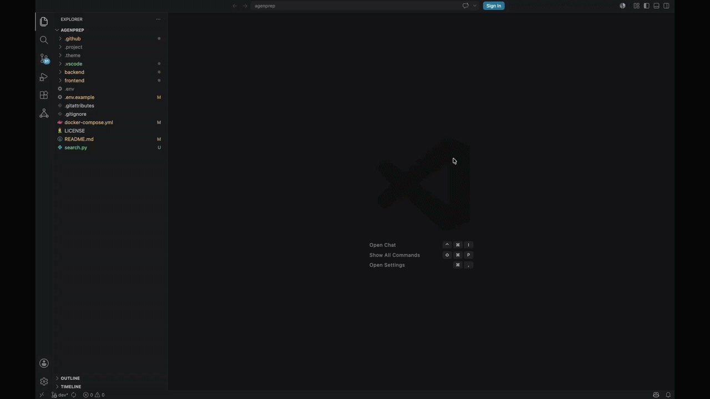

<div align="center">

# CodeArchy

**The offline AI architect that lives inside your editor.**

*Parse any codebase. Generate a senior engineer's whiteboard diagram. Ask questions. Learn. — All locally, all privately.*

[](LICENSE)
[](https://www.typescriptlang.org/)
[](https://react.dev/)
[](https://code.visualstudio.com/)
[](https://ollama.com/)
[]()



</div>

---

## What is CodeArchy?

Most developers spend days, sometimes weeks, trying to understand a new codebase. Whether you've inherited a legacy monolith, cloned an open-source repo, received a project written by an AI agent, or just returned to your own code after six months, the question is always the same: **"Where do I even start?"**

CodeArchy answers that question in seconds.

It parses your project using a battle-tested AST engine, builds a full dependency graph, and feeds the structured result to a **locally-running Gemma 4 model via Ollama**. The AI doesn't just list your files, it thinks like a senior architect and produces a **professional, high-level system architecture diagram**: named subsystems, their responsibilities, and the data flows between them.

Then it goes further. You can **talk to your codebase**. Ask questions, and CodeArchy responds with clear architectural explanations, read aloud by the built-in **Kokoro neural TTS engine**, all offline, all private, zero data ever leaves your machine.

---

## Why CodeArchy?

### The Future of Learning System Architecture

University courses teach patterns in isolation. Real-world architecture lives inside production codebases that students rarely get to see. CodeArchy closes that gap, open any open-source project and instantly see a senior-engineer-level diagram of how it is actually built. Click any subsystem. Ask "why does this exist?". Get an explanation spoken back to you. Architecture education has never been this tangible.

### Effortless Onboarding for Legacy Systems

The average developer spends **58% of their time reading and understanding code** rather than writing it. For legacy codebases this is even worse, outdated docs, tribal knowledge locked in someone who left, no architectural overview anywhere. CodeArchy generates that overview on demand, turning week-long archaeology projects into a less-minute walkthrough.

### Understand AI-Generated Codebases

AI coding agents can produce thousands of lines in minutes. The result is often syntactically correct but architecturally opaque, files that work but no one understands why they are structured the way they are. CodeArchy is the missing layer: the architectural reviewer that explains *what was built* so your team can own it with confidence.

### Reduce Tech Debt Before It Accumulates

Tech debt doesn't start when code gets messy. It starts when no one understands the architecture well enough to make good decisions. CodeArchy keeps your team aligned on structure, flags tightly-coupled subsystems, and gives every developer, from intern to principal, the same architectural context before they touch the codebase.

### Safety-First Development

Understanding *why* a module exists before changing it is the single most effective way to avoid regressions. CodeArchy's architectural view gives developers the blast-radius awareness they need: "if I change this service, here is what depends on it." Safer refactoring. Fewer surprises in production.

---

## How It Works

```
┌─────────────────────────────────────────────────────────────────┐
│                        Your Codebase                            │
└───────────────────────────┬─────────────────────────────────────┘
                            │
                    Tree-sitter AST Parser
               (TypeScript · JS · Python · Java · Go · Rust)
                            │
                    Symbol & Dependency Extractor
                  (imports · exports · call graphs)
                            │
                    Graph Builder
                  (typed nodes + weighted edges)
                            │
                    ┌───────▼────────┐
                    │  Gemma 4 via   │  ← runs 100% locally
                    │    Ollama      │    via http://localhost:11434
                    └───────┬────────┘
                            │  "Named subsystems, responsibilities,
                            │   data flows, architectural pattern"
                            │
                    Architecture Renderer
               (React Flow · Cytoscape.js for dense graphs)
                            │
                    ┌───────▼────────────────────────────────────┐
                    │  Interactive Diagram + AI Chat + Voice I/O │
                    │          (Kokoro TTS — offline)            │
                    └────────────────────────────────────────────┘
```

### The AI Pipeline in Detail

1. **Parse**: Tree-sitter incrementally builds an AST for every file, updating only what changed on each save.
2. **Extract**: Symbols, imports, exports, and call relationships are extracted into a typed dependency graph.
3. **Abstract**: The graph (not raw source code) is sent to Gemma 4 via the Ollama local REST API. The model is prompted to act as a software architect, grouping low-level modules into named, purposeful subsystems.
4. **Render**: The structured response is parsed into `ArchitectureNode` and `ArchitectureEdge` objects and visualised in React Flow.
5. **Converse**: Every follow-up question you ask is answered by the same Gemma 4 model with full architectural context maintained across turns.
6. **Narrate**: Kokoro neural TTS runs in a background Web Worker and streams synthesised speech for audio playback.

---

## Features

| Capability | Details |
|---|---|
| **Multi-language AST Parsing** | TypeScript, JavaScript, Python, Java, Go, Rust via Tree-sitter WASM |
| **Semantic Subsystem Inference** | Heuristic grouping (API, Services, Models, Auth, Events, Storage …) |
| **Gemma 4 AI Architect** | Local LLM via Ollama produces professional system architecture, not a file list |
| **Interactive React Flow Diagram** | Pan, zoom, drag, click to inspect, double-click to open source files |
| **Cytoscape.js Dense-Graph View** | Alternative layout for large, complex dependency graphs |
| **Conversational AI Assistant** | Ask architecture questions in natural language; context maintained across turns |
| **Voice Input** *(coming)* | Speak your questions; audio is transcribed and sent to Gemma 4 |
| **Kokoro Neural TTS** | AI responses are read aloud via an offline neural speech engine (GPU or CPU fallback) |
| **Story Narrator** | Step-by-step architectural walkthroughs generated and narrated by the AI |
| **Incremental Re-analysis** | Re-parses only changed files on save, stays fast on large repos |
| **Export** | Save the diagram as SVG or PNG |
| **Activity Bar Integration** | Browse subsystems and modules in a dedicated VS Code tree view |
| **Fully Offline** | Zero runtime network calls, your code never leaves your machine |

---

## Prerequisites

### 1. Install Ollama

Ollama runs Gemma 4 locally. Download it from [ollama.com](https://ollama.com) and install it.

```bash
# Verify Ollama is running
ollama --version
```

### 2. Pull a Gemma 4 Model

CodeArchy supports two Gemma 4 variants. Choose based on your hardware:

```bash
# Faster — ideal for most machines (recommended starting point)
ollama pull gemma4:e2b

# Deeper reasoning — better architectural analysis on powerful machines
ollama pull gemma4:e4b

# Maximum depth — extensive analysis for large or complex codebases
ollama pull gemma4:26b
```

### 3. Start the Ollama Server

```bash
ollama serve
```

Ollama will be available at `http://localhost:11434`. CodeArchy handles all communication with it automatically.

---

## Quick Start

1. Open any project folder in VS Code.
2. Click the **CodeArchy icon** in the Activity Bar or run **`CodeArchy: Show Architecture`** from the Command Palette (`Cmd+Shift+P` / `Ctrl+Shift+P`).
3. Select your Gemma 4 model variant in the toolbar (`e2b` for speed, `e4b` for depth, `26b` for large).
4. Explore the generated architecture diagram.
5. Open the **Chat panel** and ask: *"What does the Auth subsystem do?"* or *"Explain the data flow from the API to the database."*
6. Enable **voice output** to have the AI narrate its answers aloud via Kokoro TTS.

---

## Commands

| Command | Description |
|---|---|
| `CodeArchy: Show Architecture` | Open the interactive architecture visualisation |
| `CodeArchy: Analyze Workspace` | Run a full workspace parse and rebuild the graph |
| `CodeArchy: Refresh Architecture` | Re-analyse and update the current view |
| `CodeArchy: Export as SVG` | Save the diagram as a vector graphic |
| `CodeArchy: Export as PNG` | Save the diagram as a raster image |
| `CodeArchy: Open Sidebar` | Open the subsystem and module explorer |

---

## Configuration

| Setting | Default | Description |
|---|---|---|
| `codearchy.includedLanguages` | `["typescript","javascript","python","java","go","rust"]` | Languages to analyse |
| `codearchy.excludePatterns` | `["**/node_modules/**", ...]` | Glob patterns to skip |
| `codearchy.maxFileSize` | `500000` | Max file size in bytes to parse |
| `codearchy.aiModel` | `"none"` | Gemma 4 variant: `none` · `gemma-e2b` · `gemma-e4b` · `gemma-26b` |

---

## Gemma 4 + Ollama: The Offline AI Core

CodeArchy uses **Gemma 4**, Google DeepMind's efficient multimodal models, running entirely on your local machine via **Ollama**. There is no cloud backend, no API key, no subscription, and no telemetry. Your source code stays on your device.

The model receives the **structured dependency graph** (not raw source files), which keeps the prompt concise and within context limits even for large codebases. It is instructed to respond as a senior software architect, returning named subsystems, their roles, inter-subsystem dependencies, and a recommended architectural pattern such as MVC, Layered, Event-Driven, or Hexagonal.

Two variants are available to match your hardware:

- **`gemma4:e2b`**: 5.12B parameters · ~4 GB RAM; fast responses on consumer hardware, including machines without a discrete GPU.
- **`gemma4:e4b`**: 8B parameters · ~8 GB RAM; richer, more nuanced architectural analysis for complex or large codebases.
- **`gemma4:26b`**: 25.8B parameters · ~16 GB RAM; maximum analytical depth for large monorepos, intricate legacy systems, or deep architectural insights.

---

## Kokoro TTS: Neural Voice — Fully Offline

CodeArchy includes **Kokoro**, a lightweight neural text-to-speech engine that runs directly in the VS Code Webview via a background Web Worker. It requires no internet connection, no third-party speech service, no API key, and no cloud dependency of any kind.

Key characteristics:

- **Streaming playback**: audio begins playing as soon as the first synthesised chunk is ready, before the full response is complete.
- **GPU acceleration**: uses WebGPU when available; falls back gracefully to WASM (CPU) on any machine.
- **Multiple voices**: choose from a curated set of natural-sounding voices in the Voice Selector panel.
- **Locked to your session**: Kokoro's model weights are downloaded once and cached locally; subsequent sessions start instantly.

Voice output is a progressive enhancement, text chat always works independently. When Kokoro is active, every AI response is read aloud automatically, making CodeArchy suitable for accessibility use-cases and for developers who prefer to listen while navigating the diagram.

---

## Use Cases

| Scenario | How CodeArchy Helps |
|---|---|
| **Junior developer joins a team** | Generates an architect-level overview on day one; AI answers "why" questions in plain language |
| **Tech lead reviews AI-generated code** | Instantly see the structural pattern the AI chose; validate it against intended architecture |
| **Architect plans a refactor** | Visualise coupling between subsystems before touching a line of code |
| **CS student learns design patterns** | Open any open-source project and see patterns such as MVC, Hexagonal, or Event-Driven in action |
| **Product manager needs a system brief** | Export the diagram as SVG/PNG; use the narrated walkthrough as a presentation |
| **Security engineer assesses blast radius** | Trace dependency paths from a vulnerable module to understand exposure |
| **Team inherits a legacy codebase** | Replace weeks of archaeology with a less-minute AI-narrated architectural tour |

---

## Development

```bash
# Install extension dependencies
npm install

# Install webview UI dependencies
cd webview-ui && npm install && cd ..

# Compile everything
npm run compile

# Watch mode (rebuilds on save)
npm run watch

# Lint
npm run lint
```

Press **F5** in VS Code to launch the extension in a dedicated development host window.

See [CONTRIBUTING.md](CONTRIBUTING.md) for full development guidelines, architecture decisions, and contribution workflow.

---

## Roadmap

- [x] Tree-sitter WASM multi-language AST parsing
- [x] Semantic heuristic subsystem grouping
- [x] React Flow interactive architecture diagram
- [x] Cytoscape.js dense-graph view
- [x] Gemma 4 via Ollama — local AI architecture inference
- [x] Conversational AI assistant with context persistence
- [x] Kokoro neural TTS — offline voice output with GPU/CPU fallback
- [x] Story narrator — AI-generated architectural walkthroughs
- [x] Export diagrams as SVG and PNG
- [x] Incremental re-analysis on file save
- [ ] Voice input (audio transcription → Gemma 4)
- [ ] Custom onboarding explainer - export/share
- [ ] Multi-root workspace support
- [ ] Custom subsystem annotation rules
- [ ] Architecture diff view (detect structural drift between branches)
- [ ] Team knowledge base — share architectural annotations across a repo

---

## License

[MIT](LICENSE) — free to use, modify, and distribute.
